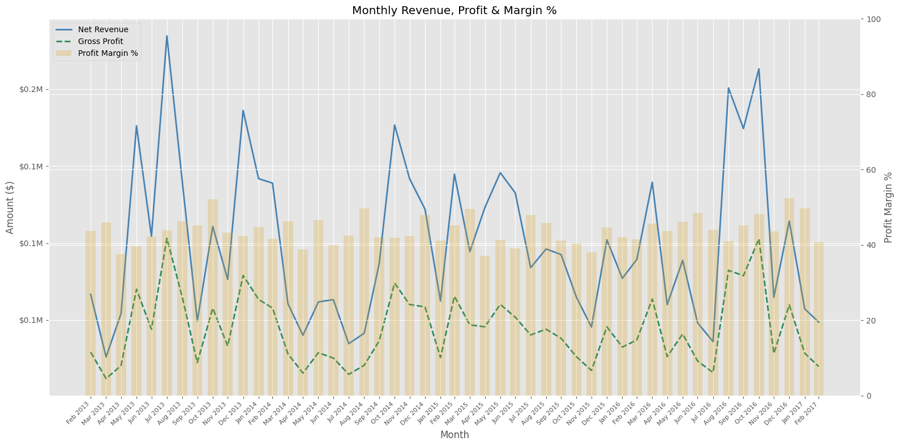
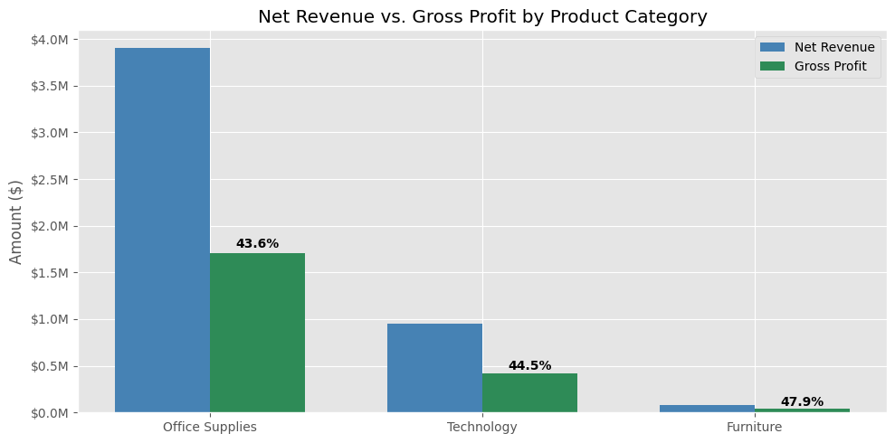
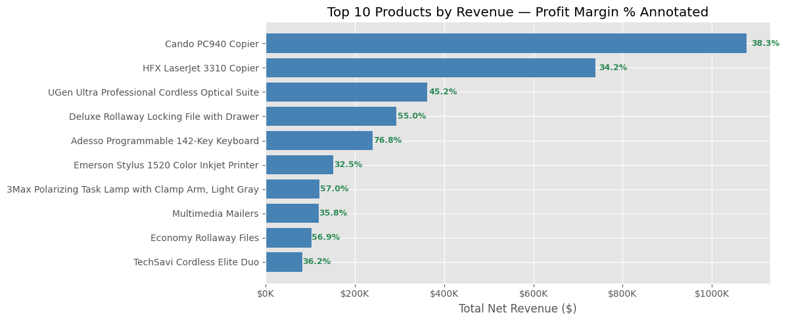
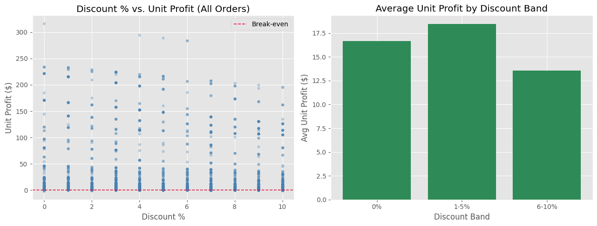

# Analyzing Sales Performance to Identify Profit Leakage and Growth Opportunities

---

## Objective

This project investigates where a retail business loses margin despite growing revenue. Rather than surface-level sales reporting, the focus is on **profit leakage from loss-making products**, **discount inefficiency across order lines**, and whether the business's growth is backed by **sustainable profit or inflated by volume alone**.

All financial metrics (Revenue, COGS, Gross Profit, Margin %) were re-derived from source columns — the dataset's pre-calculated fields contained errors and were discarded.

---

## Dataset Overview

- **Source:** [Kaggle — Retail Sales Dataset](https://www.kaggle.com/datasets/rajneesh231/retail-insights-a-comprehensive-sales-dataset)
- **5,000 rows** across 257 unique products — each row is an order line item
- Covers **sales price, cost price, discount %, and order quantity** — enough to reconstruct the full P&L per transaction
- Spans **3 product categories:** Office Supplies, Technology, Furniture
- **4 customer segments:** Corporate, Home Office, Small Business, Consumer
- **Time period:** 2013–2017 across NSW and VIC (Australia)

---

## Key Business Questions (KPIs)

| # | Question |
|---|----------|
| KPI 1 | What proportion of products operate at negative margins, and how much do they impact overall profitability? |
| KPI 2 | How are revenue and profit trending over time, and are they aligned? |
| KPI 3 | Which categories generate high revenue but low or negative profit? |
| KPI 4 | Are top-selling products contributing positively to profit? |
| KPI 5 | Which products consistently generate losses, and what factors drive these losses? |
| KPI 6 | How does discounting impact profitability — is there a break-even threshold? |
| KPI 7 | Is business growth driven by sustainable profit, or just increased revenue? |

---

## Key Insights

**1. Furniture is the most margin-efficient category — and the most ignored.**  
Furniture carries the highest gross margin (47.94%) of all three categories, yet generates only $82K in net revenue — 47× less than Office Supplies ($3.9M). The category isn't underperforming; it's under-invested.

**2. The one loss-making product is a cost problem, not a discount problem.**  
OCColor Flip is the only product with a negative weighted margin (−48.08%). Its average discount is just **2.0%** — well below the company average of 5.03%. The losses are structural: the cost price exceeds the selling price regardless of discounting. This is a pricing or procurement error, not a sales behaviour issue.

**3. Discounting between 6–10% costs 26% of unit profit with no volume justification.**  
Orders in the 1–5% discount band average **$18.44 unit profit**. Those in the 6–10% band drop to **$13.56** — a 26% decline — without a corresponding increase in order volume that would justify the margin sacrifice. There is no evidence discounts above 5% drive enough incremental volume to compensate.

**4. High revenue does not mean high margin — even in the top 10.**  
The top 10 products by revenue include margins ranging from 32.5% (Emerson Inkjet Printer) to 76.8% (Adesso Programmable Keyboard). The highest-revenue product (Cando PC940 Copier) sits at only 38.3% margin. Volume and profitability are misaligned at the product level.

**5. Gross margin has held steady at 40–52% through all revenue fluctuations.**  
Despite significant monthly revenue swings (from $26K to $234K), gross margin has not deteriorated over time. This confirms that growth is not being bought through unsustainable discounting — the business model itself is structurally sound.

**6. Corporate customers generate the most revenue ($1.66M, 33.7% of total) — but Consumer segment is the smallest at $915K.**  
The gap between the top and bottom customer segments is 1.8×. Corporate customers are driving disproportionate value and represent the highest-priority retention segment.

---

## Visualizations

**Monthly Revenue, Profit & Margin % (KPIs 2 & 7)**  
Confirms whether profit scales with revenue over time or quietly decouples — the earliest indicator of a structural margin problem.



---

**Net Revenue vs. Gross Profit by Category (KPI 3)**  
Side-by-side comparison with margin % annotated — makes the Furniture opportunity immediately visible.



---

**Top 10 Products by Revenue — Profit Margin Annotated (KPI 4)**  
Revenue rank alone is misleading. Margin % overlaid on each bar forces the right question: are we selling the right things, or just a lot of things?



---

**Discount % vs. Unit Profit (KPI 6)**  
Scatter + band bar side-by-side. The band chart isolates the 6–10% threshold where unit profit drops sharply.



---

## Business Recommendations

| Finding | Recommendation |
|--------|----------------|
| Furniture has 47.94% margin but <2% of revenue | Run a targeted push in this category — pricing power exists, distribution doesn't |
| OCColor Flip has −48% margin from cost structure | Audit cost price vs. retail price — either renegotiate with supplier or discontinue |
| Unit profit drops 26% at 6–10% discount band | Set a hard discount cap at 5% without VP-level approval |
| Top 10 revenue products range 32–77% margin | Shift promotional focus toward high-margin SKUs (e.g. Adesso keyboard at 76.8%) |
| Corporate segment is 1.8× larger than Consumer | Prioritise account retention and upsell programs for Corporate customers |
| Margin is stable at 40–52% across all months | Don't chase volume at the cost of margin — the model is working, scale it |

---

## Tools & Technologies

- **pandas** — data processing, data cleaning, analysis aggregation, and KPI computation
- **matplotlib** — all visualizations

---

## Project Structure

```
Retail-Sales-Analysis/
│
├── data/
├── notebook.ipynb
├── README.md          ← you are here
└── images/           
```
